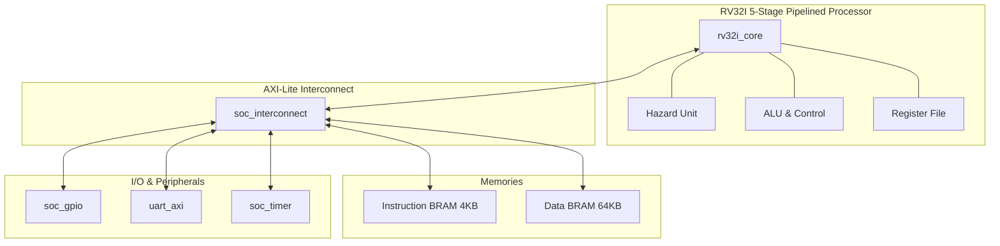

# 🚀 RV32I RISC-V System-on-Chip (SoC)

[](https://www.xilinx.com/products/silicon-devices/fpga/artix-7.html)
[](https://en.wikipedia.org/wiki/Verilog)
[](https://www.xilinx.com/products/design-tools/vivado.html)
[](LICENSE)

A high-performance, compact **RV32I RISC-V System-on-Chip (SoC)** implemented in synthesizable Verilog. Optimized for AMD/Xilinx 7-Series FPGAs (specifically targetting the Artix-7 device), this SoC features a custom 5-stage pipelined CPU core, hazard detection/resolution, an AXI-Lite style interconnect, standard system peripherals, and a dedicated browser-based web compilation IDE.

---

## 📐 SoC System Architecture

The SoC integrates the CPU core with memory blocks and memory-mapped peripherals over a central shared interconnect using AXI-Lite handshakes.



---

## ✨ Features

### 💻 Custom RV32I Processor Core
* **5-Stage Pipeline**: Balanced Fetch (IF), Decode (ID), Execute (EX), Memory (MEM), and Writeback (WB) stages.
* **Hazard Resolution**: Fully-featured Hazard Unit supporting data forwarding (EX-to-EX, MEM-to-EX) and automatic load-use stall insertion.
* **Instruction Set**: Implements the base `RV32I` integer ISA (integer arithmetic, logical operations, shifts, branches, jumps, and memory access).

### 🔌 SoC System & Peripherals
* **Interconnect**: AXI-Lite style synchronous crossbar for robust, scalable peripheral access.
* **Internal Memories**: Dual-port Block RAM (BRAM) structure with a 4 KB Boot/Instruction memory and a 64 KB Main Data memory.
* **UART Controller**: Full-duplex AXI-compatible UART with configurable baud rates, internal TX/RX FIFOs, and status reporting.
* **Hardware Timer**: Real-time 64-bit machine timer (`mtime` / `mtimecmp`) supporting microsecond-level timing and tick counting.
* **GPIO Module**: Configurable general-purpose inputs/outputs mapped directly to board switches, buttons, and LEDs.

---

## 🗺️ Memory Map

Peripherals and memories are mapped directly into a single 32-bit physical address space:

| Block Name | Base Address | Size | Access | Description |
| :--- | :--- | :--- | :--- | :--- |
| **Instruction Memory (ROM)** | `0x0000_0000` | 4 KB | R/W | Boot ROM holding executable code (`program.mem`) |
| **Data Memory (RAM)** | `0x1000_0000` | 64 KB | R/W | Main system data memory / scratchpad |
| **GPIO** | `0x2000_0000` | 4 KB | R/W | General Purpose Input/Output register interface |
| **UART** | `0x3000_0000` | 4 KB | R/W | Serial transmission port register interface |
| **Timer** | `0x4000_0000` | 4 KB | R/W | Hardware ticks counter and match comparator |

---

## 🎛️ Peripheral Register Definitions

### GPIO (`0x2000_0000`)
* `0x00` (RO): **GPIO Input** — Status of onboard switches/buttons.
* `0x04` (RW): **GPIO Output** — Control registers for onboard LEDs.
* `0x08` (RW): **Direction register** — Configures bits as Input (0) or Output (1).

### UART (`0x3000_0000`)
* `0x00` (WO): **TX Data Register** — Write character here to transmit.
* `0x04` (RO): **RX Data Register** — Read received character here.
* `0x08` (RO): **Status Register** — `bit 0 = RX Valid` (data waiting), `bit 1 = TX Full` (wait before write).
* `0x0C` (RW): **Control Register** — `bit 0 = UART Enable`.
* `0x10` (RW): **Baud Rate Divider** — Configures transmission frequency relative to system clock.

### Timer (`0x4000_0000`)
* `0x00` (RW): **mtime [31:0]** — Low-order word of hardware clock tick counter.
* `0x04` (RW): **mtime [63:32]** — High-order word of hardware clock tick counter.
* `0x08` (RW): **mtimecmp [31:0]** — Low-order word of comparator target.
* `0x0C` (RW): **mtimecmp [63:32]** — High-order word of comparator target.

---

## 📂 Repository Structure

```text
├── core/             # Pipelined RV32I Processor pipeline logic
├── soc/              # Bus Interconnect, BRAM controllers, System top modules
│   └── software/     # C and assembly programs, linker scripts, compiler scripts
├── peripherals/      # UART transmitter/receiver and helper FIFO FIFOs
├── constraints/      # Urbana Artix-7 constraints (XDC)
├── ide/              # Web-based code editor and compiler interface
├── scripts/          # Tcl script to regenerate the Vivado project
├── setup_sim.tcl     # Tcl simulation helper script
└── README.md         # This documentation
```

---

## 🚀 Quick Start

### 1. Build and Compile C Code
The bare-metal software utilizes the standard `riscv64-unknown-elf` toolchain to compile code into `.mem` initialization files:

```powershell
cd soc/software
make
```

> [!NOTE]
> Make sure you have `riscv64-unknown-elf-gcc`, `riscv64-unknown-elf-objcopy`, and `Python` in your system path.

### 2. Generate the Vivado Project
You do not need to check-in massive, machine-specific Vivado project caches. Regenerate a clean project folder instantly using:

```powershell
vivado -mode batch -source scripts/create_vivado_project.tcl
```

This will automatically create a new project under `build/vivado/` using the active RTL files and configure `soc/software/hello.mem` as the default instruction memory.

### 3. Simulate the Design
1. Launch Vivado and open the newly created project `build/vivado/rv32i_soc.xpr`.
2. In the Vivado Tcl console, run:
   ```tcl
   source setup_sim.tcl
   ```
3. Run simulation. The top-level testbench is `rv32i_soc_full_tb.v`, which executes standard instructions from `rv32i_test_program.mem`.

### 4. Run the Web IDE (C Compiler & Editor)
The folder `ide/` contains a lightweight local development web application:
1. Open a terminal in `ide/` and run `npm install`.
2. Start the dev server using `npm start` or `node app.js`.
3. Open your browser and navigate to the local port to write C code, compile it on the fly, and download the `.mem` target file for your hardware.

---

## 📜 License
This project is released under the [MIT License](LICENSE).
