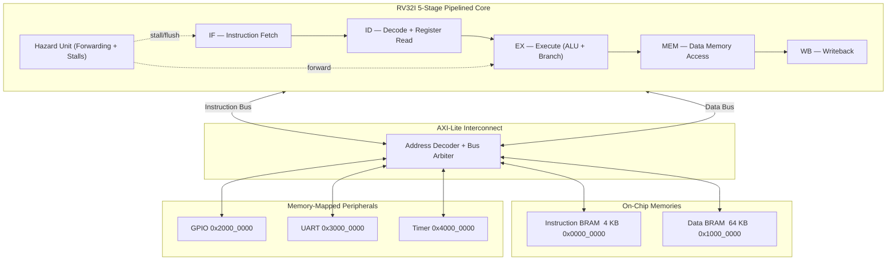

# 🚀 RV32I RISC-V System-on-Chip (SoC)

[](https://www.xilinx.com/products/silicon-devices/fpga/artix-7.html)
[](https://en.wikipedia.org/wiki/Verilog)
[](https://www.xilinx.com/products/design-tools/vivado.html)
[](https://github.com/Aryan16544/rv32i-soc/actions/workflows/verify.yml)
[](LICENSE)

A fully synthesizable **RV32I RISC-V System-on-Chip** written in Verilog, targeting AMD/Xilinx Artix-7 FPGAs.
It features a custom 5-stage pipelined CPU core with data hazard resolution, an AXI-Lite interconnect,
on-chip BRAM memories, and real hardware peripherals (UART, GPIO, Timer).
Bare-metal C and Assembly programs can be written, compiled, and loaded directly onto the SoC.

---

## 📐 System Architecture

The CPU core connects to all memories and peripherals through a central AXI-Lite style bus interconnect.
All peripheral registers are memory-mapped into the same 32-bit address space as the instruction and data memories.



---

## ✨ Features

### CPU Core
| Feature | Detail |
|:---|:---|
| **ISA** | Base `RV32I` Integer Instruction Set |
| **Pipeline** | 5 Stages — IF / ID / EX / MEM / WB |
| **Data Forwarding** | EX→EX and MEM→EX paths |
| **Load-Use Hazard** | Auto 1-cycle stall |
| **Control Hazard** | Branch at EX stage, pipeline flush |

### SoC Peripherals
| Component | Detail |
|:---|:---|
| **Interconnect** | AXI-Lite synchronous bus with address decode |
| **Instruction BRAM** | 4 KB, initialized from `.mem` file at synthesis |
| **Data BRAM** | 64 KB for stack, heap, globals |
| **UART** | Full-duplex, configurable baud, TX/RX FIFOs |
| **GPIO** | Bit-addressable LEDs and switches |
| **Timer** | 64-bit `mtime` / `mtimecmp` counter |

---

## 🗺️ Memory Map

| Region | Base Address | Size | Description |
|:---|:---|:---|:---|
| Instruction Memory | `0x0000_0000` | 4 KB | BRAM holding compiled program (`.mem`) |
| Data Memory | `0x1000_0000` | 64 KB | Stack, heap, and global variables |
| GPIO | `0x2000_0000` | 4 KB | Switches (read) and LEDs (write) |
| UART | `0x3000_0000` | 4 KB | Serial communication registers |
| Timer | `0x4000_0000` | 4 KB | Hardware clock counter |

---

## 📂 Repository Structure

```
rv32i-soc/
├── core/                        # CPU Pipeline RTL
│   ├── rv32i_core.v             #   Top-level CPU interconnect
│   ├── fetch_stage.v            #   IF  stage
│   ├── decode_stage.v           #   ID  stage
│   ├── execute_stage.v          #   EX  stage
│   ├── memory_stage.v           #   MEM stage
│   ├── writeback_stage.v        #   WB  stage
│   ├── hazard_unit.v            #   Forwarding and stall logic
│   ├── control_unit.v           #   Opcode decoder
│   ├── alu.v                    #   Arithmetic Logic Unit
│   ├── register_file.v          #   32 x 32-bit registers
│   └── rv32i_defines.vh         #   ISA constants (opcodes, funct3/7)
│
├── soc/                         # SoC Integration RTL
│   ├── rv32i_soc.v              #   SoC top (CPU + bus + peripherals)
│   ├── fpga_top.v               #   FPGA wrapper (BUFG, resets, pins)
│   ├── soc_interconnect.v       #   Bus address decoder and switch
│   ├── soc_axi_adapter.v        #   AXI-Lite to simple IP bridge
│   ├── soc_bram_imem.v          #   Instruction BRAM
│   ├── soc_bram_dmem.v          #   Data BRAM
│   ├── soc_gpio.v               #   GPIO peripheral
│   ├── soc_timer.v              #   64-bit hardware timer
│   ├── soc_uart.v               #   UART SoC wrapper
│   ├── soc_map.vh               #   Address/size constants
│   └── software/                #   Bare-metal programs
│       ├── main.c               #     Full C demo (UART + GPIO)
│       ├── start.S              #     _start entry point
│       ├── link.ld              #     Linker script
│       ├── Makefile             #     Build system
│       ├── make_hex.py          #     Binary to .mem converter
│       ├── hello.S              #     Hello World (UART)
│       ├── led.S                #     LED blink
│       ├── sw_to_led.S          #     Switch mirror to LED
│       └── alphabet.S           #     Print A-Z over UART
│
├── peripherals/                 # Peripheral RTL
│   ├── uart_axi.v               #   AXI-Lite UART controller
│   ├── uart_tx.v                #   TX engine
│   ├── uart_rx.v                #   RX engine
│   ├── uart_tx_simple.v         #   Simple polling TX
│   └── fifo.v                   #   Synchronous FIFO
│
├── constraints/                 # FPGA Pin Constraints
│   ├── nexys_a7_100t.xdc        #   Nexys A7-100T
│   └── urbana.xdc               #   Urbana Artix-7
│
├── scripts/
│   └── create_vivado_project.tcl  # Auto-generate Vivado project
│
├── .github/workflows/verify.yml  # CI: syntax check on every push
├── rv32i_soc_full_tb.v          # Full SoC regression testbench
├── rv32i_test_program.mem       # Pre-built simulation test program
├── setup_sim.tcl                # Vivado simulation helper
└── gen_test_program.py          # Test program generator
```

---

## 🛠️ Prerequisites

### Required Tools
| Tool | Purpose |
|:---|:---|
| **Vivado 2025.1+** | RTL synthesis, simulation, bitstream |
| **Artix-7 FPGA board** | Hardware target (Nexys A7 or Urbana) |
| **RISC-V GNU Toolchain** (`riscv64-unknown-elf-gcc`) | Compile C/Assembly |
| **Python 3.7+** | Convert binary to `.mem` format |
| **make** | Build system |

### Installing the RISC-V Toolchain

**Windows:** Download from [SiFive Freedom Tools](https://github.com/sifive/freedom-tools/releases) or [xPack RISC-V GCC](https://github.com/xpack-binaries/riscv-none-elf-gcc/releases). Extract and add the `bin/` folder to your system `PATH`.

**Linux (Ubuntu/Debian):**
```bash
sudo apt-get install gcc-riscv64-unknown-elf
```

**Verify:**
```bash
riscv64-unknown-elf-gcc --version
```

---

## 🚀 Getting Started — Step by Step

### Step 1: Clone the Repository

```bash
git clone https://github.com/Aryan16544/rv32i-soc.git
cd rv32i-soc
```

---

### Step 2: Write Your Program

All source files live in `soc/software/`. You can write in **C** or **Assembly**.

#### Option A — C Program

Edit `soc/software/main.c`. Hardware addresses are pre-defined:

```c
#define UART_TX   (*(volatile uint32_t *)(0x30000000)) // transmit register
#define UART_STAT (*(volatile uint32_t *)(0x30000008)) // status register
#define GPIO_OUT  (*(volatile uint32_t *)(0x20000004)) // LED output
#define GPIO_IN   (*(volatile uint32_t *)(0x20000000)) // switch input
```

Minimal "Hello, World!" in C:

```c
#include <stdint.h>
#define UART_TX   (*(volatile uint32_t *)(0x30000000))
#define UART_STAT (*(volatile uint32_t *)(0x30000008))

void uart_putc(char c) {
    while (UART_STAT & 0x02);  // Wait: TX buffer not full
    UART_TX = c;
}
void uart_puts(const char *s) { while (*s) uart_putc(*s++); }

int main() {
    uart_puts("Hello, RV32I SoC!\r\n");
    while (1);
}
```

#### Option B — Assembly Program

| File | Description |
|:---|:---|
| `hello.S` | Sends "Hello, World!" over UART |
| `led.S` | Blinks LEDs in alternating pattern |
| `sw_to_led.S` | Mirrors switch state to LEDs |
| `alphabet.S` | Prints A through Z over UART |

To use a standalone assembly file, update the `Makefile` to compile your `.S` file directly.

---

### Step 3: Compile

```bash
cd soc/software
make
```

| Output | Description |
|:---|:---|
| `program.elf` | ELF binary (for disassembly) |
| `program.bin` | Raw binary |
| `program.mem` | **Hex image — what the FPGA loads** |

```bash
make clean     # Clean all outputs
make dump      # Disassemble to program.asm
```

> [!IMPORTANT]
> Run `make` every time you change your code. The `.mem` file must be regenerated before re-synthesizing or re-simulating.

---

### Step 4: Load Program into the SoC

```bash
# Windows
copy soc\software\program.mem soc\program.mem

# Linux/macOS
cp soc/software/program.mem soc/program.mem
```

> [!NOTE]
> `soc/program.mem` initializes the instruction BRAM at synthesis. Update it before every new build.

---

### Step 5: Generate the Vivado Project

The Vivado project is not stored in Git. Regenerate it from the Tcl script:

```powershell
vivado -mode batch -source scripts/create_vivado_project.tcl
```

What the script does:
- Creates project at `build/vivado/rv32i_soc.xpr`
- Adds all RTL source files
- Adds board constraints (XDC)
- Sets `fpga_top` as synthesis top
- Sets `rv32i_soc_full_tb` as simulation top

> [!TIP]
> Default part: `xc7a12tcpg238-1`. Edit `-part` in the script for a different board.

---

### Step 6: Simulate

1. Open `build/vivado/rv32i_soc.xpr` in Vivado
2. In the Tcl Console, run:
   ```tcl
   source setup_sim.tcl
   ```
3. Click **Flow > Run Simulation > Run Behavioral Simulation**

The testbench `rv32i_soc_full_tb.v` loads `rv32i_test_program.mem` and verifies:
- ALU operations (ADD, SUB, AND, OR, XOR, shifts)
- Load and store instructions (LW, SW, LB, SB)
- Branch instructions (BEQ, BNE, BLT, BGE)
- UART transmission

Expected console output:
```
[TB] Starting RV32I SoC Full Verification
[TB] Reset released, CPU running
[PASS] ALU Operations
[PASS] Load/Store
[PASS] Branch Instructions
[PASS] UART Transmit
[TB] All tests passed. Simulation complete.
```

---

### Step 7: Synthesize and Program FPGA

Inside Vivado:

1. **Run Synthesis** — Flow > Run Synthesis
2. **Run Implementation** — Flow > Run Implementation
3. **Generate Bitstream** — Flow > Generate Bitstream
4. **Open Hardware Manager** — top toolbar button
5. **Open Target > Auto Connect**
6. **Program Device** — choose `.bit` from `build/vivado/rv32i_soc.runs/impl_1/`

The SoC is now live and running your program on the FPGA.

---

### Step 8: Connect UART Terminal

| Setting | Value |
|:---|:---|
| Baud Rate | 115200 |
| Data Bits | 8 |
| Parity | None |
| Stop Bits | 1 |
| Flow Control | None |

**Windows:** [PuTTY](https://www.putty.org/) or [TeraTerm](https://ttssh2.osdn.jp/)

**Linux/macOS:**
```bash
screen /dev/ttyUSB0 115200
# Exit: Ctrl+A then K
```

---

## 🎛️ Peripheral Register Reference

### GPIO — Base: `0x2000_0000`

| Offset | Name | Access | Description |
|:---|:---|:---|:---|
| `0x00` | GPIO_IN | R | Bit-per-pin state of switches/buttons |
| `0x04` | GPIO_OUT | R/W | Write 1 = LED on, 0 = LED off (per bit) |
| `0x08` | GPIO_DIR | R/W | 0 = Input, 1 = Output (per bit) |

```c
// Mirror switches to LEDs
*(volatile uint32_t *)0x20000004 = *(volatile uint32_t *)0x20000000;
```

---

### UART — Base: `0x3000_0000`

| Offset | Name | Access | Description |
|:---|:---|:---|:---|
| `0x00` | UART_TX | W | Write byte to transmit |
| `0x04` | UART_RX | R | Read received byte |
| `0x08` | UART_STATUS | R | bit[0]=RX ready, bit[1]=TX full |
| `0x0C` | UART_CTRL | R/W | bit[0]=enable |
| `0x10` | UART_BAUD | R/W | Divider = CLK_HZ / (BAUD × 16) − 1 |

```c
void uart_putc(char c) {
    while (*(volatile uint32_t *)0x30000008 & 0x2); // Wait TX not full
    *(volatile uint32_t *)0x30000000 = c;
}

char uart_getc() {
    while (!(*(volatile uint32_t *)0x30000008 & 0x1)); // Wait RX ready
    return (char)(*(volatile uint32_t *)0x30000004 & 0xFF);
}
```

---

### Timer — Base: `0x4000_0000`

| Offset | Name | Access | Description |
|:---|:---|:---|:---|
| `0x00` | MTIME_LO | R/W | Low 32-bits of free-running counter |
| `0x04` | MTIME_HI | R/W | High 32-bits of free-running counter |
| `0x08` | MTIMECMP_LO | R/W | Low 32-bits of compare target |
| `0x0C` | MTIMECMP_HI | R/W | High 32-bits of compare target |

```c
uint32_t get_ticks()         { return *(volatile uint32_t *)0x40000000; }
void delay_ticks(uint32_t n) { uint32_t t = get_ticks(); while ((get_ticks()-t) < n); }
```

---

## 🔄 Complete Workflow — At a Glance

```
Write code (soc/software/main.c or .S)
            |
            v
        make
            |
            v
     program.mem  <--- your FPGA binary
            |
     copy to soc/program.mem
            |
     +-------+--------+
     |                |
     v                v
 SIMULATE           FPGA
 Vivado             Run Synthesis
 setup_sim.tcl      Run Implementation
 Run Simulation     Generate Bitstream
 Check [PASS]       Program Device
                        |
                        v
                  Open UART terminal
                  115200 baud
                  See your output!
```

---

## 📋 Example Programs

| File | Description |
|:---|:---|
| `hello.S` | Sends "Hello, World!\r\n" over UART |
| `led.S` | Alternates 0x5555 / 0xAAAA on LEDs |
| `sw_to_led.S` | Reads GPIO_IN, writes to GPIO_OUT |
| `alphabet.S` | Prints A through Z over UART |
| `main.c` + `start.S` | Full C program with UART + GPIO |

---

## 🤝 Contributing

1. Fork the repo
2. Create a branch: `git checkout -b feature/my-feature`
3. Make changes (RTL or software)
4. Verify locally: `iverilog -g2012 -o /dev/null core/*.v soc/*.v peripherals/*.v`
5. Push and open a Pull Request — CI runs automatically

---

## 📜 License

Released under the [MIT License](LICENSE). Free to use, modify, and redistribute.
